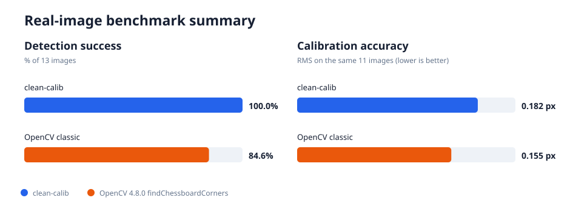

# clean-calib

A from-scratch implementation of **Zhang's planar checkerboard camera
calibration** in modern C++17. The goal is not maximum performance or
feature coverage; the goal is **clarity, readability, and educational
value**. Most calibration code is buried inside large libraries — this
project tries to make every step inspectable.

## What this project is

- An end-to-end implementation of single-camera calibration:
  - Synthetic dataset generation
  - Pinhole + Brown-Conrady distortion model
  - Homography estimation (DLT)
  - Zhang's closed-form intrinsics initialization
  - Nonlinear refinement (Gauss-Newton, then Levenberg-Marquardt)
  - Checkerboard corner detection
- Built with **only** Eigen (linear algebra) and **stb** (image I/O).
- Organised so each module can be read, tested, and understood
  independently.

## What this project is not (yet)

- Not a replacement for OpenCV.
- Not multi-camera / stereo / fisheye.
- Not optimised for real-time use.
- Not a polished CLI tool — it is a learning scaffold built in small,
  verifiable milestones (see `PROGRESS.md`).

## Dependencies

- A C++17 compiler (gcc 9+, clang 10+).
- CMake 3.16+.
- **Eigen 3.4** (header-only, system-installed or via FetchContent).
- **stb_image.h** and **stb_image_write.h** placed in
  `external/stb/`. See `external/stb/README.md` for download links.

No OpenCV. No Ceres. No Sophus. No other image libraries.

OpenCV is used only by an optional, separately built comparison benchmark; it
is never linked into the library, CLI, or normal test suite.

## Build

```bash
cd clean-calib
cmake -B build -DCMAKE_BUILD_TYPE=Release
cmake --build build -j
```

This produces three artifacts:

- `build/libclean_calib.a`        — the library
- `build/clean_calib`             — the CLI executable
- `build/clean_calib_tests`       — the test runner

Run the tests:

```bash
./build/clean_calib_tests
```

## Real-image performance

The current detector and calibration pipeline was evaluated on all 13 public
640x480 OpenCV `left*.jpg` calibration images, using their 6x7-inner-corner
checkerboard. This is the dataset checked into [`data/opencv_left`](data/opencv_left),
not a synthetic test set.



| Metric | clean-calib | OpenCV 4.8 classic |
|---|---:|---:|
| Boards detected | **13/13** | 11/13 |
| Detection success | **100.0%** | 84.6% |
| Calibration RMS on the shared 11 views | 0.1821 px | **0.1554 px** |

`clean-calib` detects two views missed by OpenCV's classic
`findChessboardCorners`; OpenCV remains faster and gives about 0.027 px lower
RMS on the identical 11-view subset. The full methodology, per-image plot,
raw CSV measurements, machine details, and reproduction commands are in the
[`benchmarks` report](benchmarks/README.md).

## Python API and browser GUI

An optional dependency-free CPython binding exposes the complete C++ detector
and calibration pipeline as `clean_calib.calibrate(...)`. A local HTML GUI lets
you upload images or select a folder and compare our results with OpenCV,
including detection coverage, shared-view RMS, intrinsics, distortion,
per-image error plots, timings, and downloadable JSON.

```bash
cmake -S . -B build-python \
  -DCMAKE_BUILD_TYPE=Release \
  -DCLEAN_CALIB_BUILD_PYTHON=ON \
  -DPython3_EXECUTABLE=/usr/bin/python3
cmake --build build-python -j

CLEAN_CALIB_PYTHON_PATH=build-python/python \
  /usr/bin/python3 python/gui/app.py
```

Then open `http://127.0.0.1:5000`. See the [Python and GUI guide](python/README.md)
for dependencies, API examples, returned metrics, and test behavior.

## First commands to try

```bash
# Print metadata for an image
./build/clean_calib image-info path/to/image.png

# Round-trip an image through load + save
./build/clean_calib image-copy input.png output.png

# Generate a planar checkerboard's inner corner coordinates
./build/clean_calib generate-board --rows 6 --cols 9 --square-size 0.025
```

## Project architecture

```
clean-calib/
  external/stb/                — stb_image headers (user-supplied)
  include/clean_calib/
    calib/                     — homography, Zhang initialization, refinement
    core/                      — Point2D, Point3D, Image, CameraModel, Pose
    detection/                 — Harris response and checkerboard detector
    image/                     — image_io (load/save)
    synthetic/                 — checkerboard object-point generator
    util/                      — small utilities (Result, etc.)
  src/                         — implementation .cpp files
  tests/                       — independent unit tests
  benchmarks/                  — optional OpenCV comparison and plots
  examples/                    — sample images & synthetic outputs
  data/                        — calibration datasets
```

The library is intentionally split so that, e.g., the homography solver
knows nothing about images, and the image module knows nothing about
calibration. Detection and calibration math live in different modules.

## Calibration pipeline overview

1. **Capture**: take many photos of a known planar checkerboard from
   different viewpoints.
2. **Detect** the checkerboard's inner corners in each image.
3. For each view, estimate a **homography** mapping the planar board to
   the image (DLT + normalisation).
4. Use Zhang's constraints on the image of the absolute conic to
   recover **intrinsics** in closed form from the set of homographies.
5. Recover each view's **extrinsics** from `K^{-1} H`.
6. Initialise distortion to zero, then **refine everything jointly**
   (intrinsics + distortion + per-view extrinsics) by minimising
   reprojection error with Levenberg-Marquardt.

## Why so many small milestones?

Calibration is a stack of mathematical steps. If the final
reprojection error looks bad, you need to know which step is wrong.
Building each step on its own — image I/O, projection, homography,
Zhang init, refinement — and testing each one in isolation, makes
debugging tractable. See `PROGRESS.md` for the full milestone list.

Before starting a milestone, use the [study guides](docs/README.md) for its
prerequisites, derivations, practice exercises, implementation stages, tests,
and focused resources.
