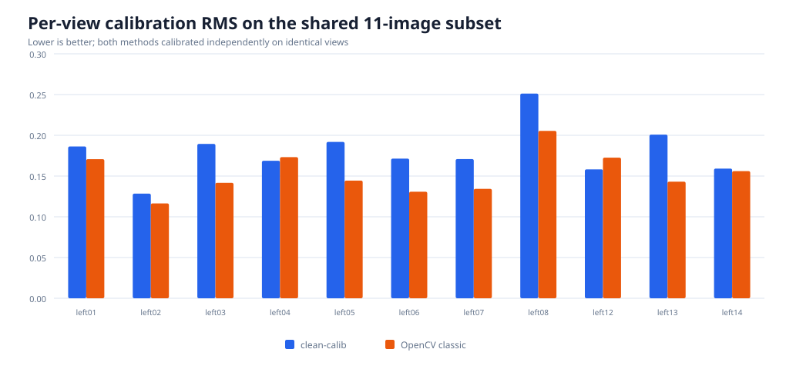

# OpenCV comparison benchmark

This benchmark compares `clean-calib` with OpenCV's classic
`findChessboardCorners` + `cornerSubPix` + `calibrateCamera` pipeline. It uses
the 13 public 640x480 `left*.jpg` images in `data/opencv_left` and a 6x7-inner-
corner pattern. The images come from OpenCV's `samples/data` directory; see the
[dataset metadata](../data/opencv_left/README.md).

## Results




| Metric | clean-calib | OpenCV 4.8 classic |
|---|---:|---:|
| Boards detected | **13/13** | 11/13 |
| Detection success | **100.0%** | 84.6% |
| Calibration RMS, each detector's usable images | 0.1828 px (13) | **0.1554 px** (11) |
| Calibration RMS, shared 11 images | 0.1821 px | **0.1554 px** |
| Median detection time, single run | 52.7 ms | **4.0 ms** |

The shared-subset row is the fair accuracy comparison: both pipelines are
calibrated independently using exactly the same 11 source images. OpenCV is
about 0.027 px lower in RMS and substantially faster; `clean-calib` detects the
two difficult views (`left09` and `left11`) that the classic OpenCV detector
misses. The timing row is only a local single-run indication, not a controlled
performance study.

Results were generated on 2026-08-29 in Release mode using OpenCV 4.8.0, GCC
9.4.0, Linux x86_64, and an AMD Ryzen 7 6800HS. Raw measurements are checked in
under `results/`.

## Reproduce

OpenCV is an optional benchmark-only dependency; the library and normal test
suite do not link against it.

```bash
cmake -S . -B build-benchmark \
  -DCMAKE_BUILD_TYPE=Release \
  -DCLEAN_CALIB_BUILD_OPENCV_BENCHMARK=ON
cmake --build build-benchmark -j
./build-benchmark/clean_calib_opencv_benchmark \
  data/opencv_left benchmarks/results
python3 benchmarks/plot_results.py
```

The benchmark records:

- `summary.csv`: detection coverage, full calibration RMS, and intrinsics;
- `detections.csv`: per-image success and wall-clock detector time;
- `common_per_view_rms.csv`: per-view RMS on the shared 11-image subset.

The comparison intentionally uses OpenCV's classic detector, not
`findChessboardCornersSB`. Detector timings include subpixel refinement for
both implementations but exclude image loading. Both calibrations use five
Brown-Conrady distortion coefficients; `clean-calib` additionally refines the
camera-matrix skew term, while OpenCV keeps it at zero.
